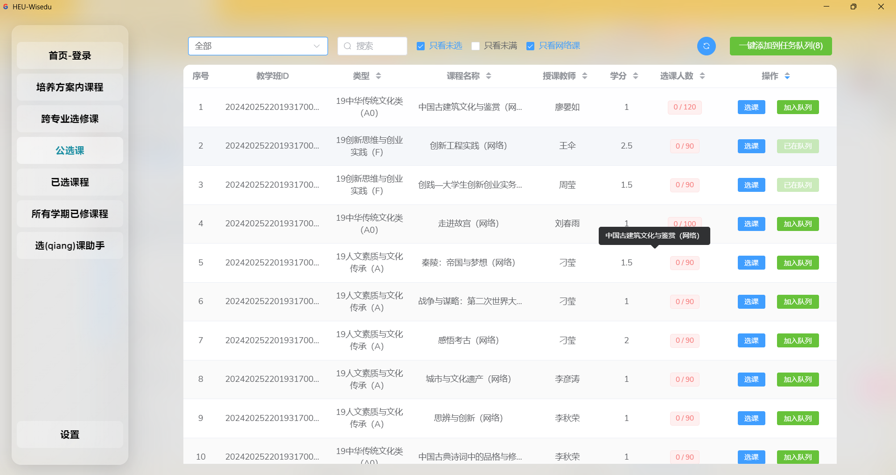

# HEU-Wisedu

HEU-Wisedu是一款基于[哈尔滨工程大学教务选课系统](https://jwxk.hrbeu.edu.cn/) `API`、[Acrylic](https://github.com/only9464/Acrylic) `模版`开发的跨平台桌面应用程序，主要功能为查看课程信息、选课等。

[](https://github.com/only9464/HEU-Wisedu/releases)
[](https://github.com/only9464/HEU-Wisedu/issues)
[](https://github.com/only9464/HEU-Wisedu/pulls)
[](https://github.com/only9464/HEU-Wisedu/releases/latest)
[](https://github.com/only9464/HEU-Wisedu/graphs/contributors)
[](https://github.com/only9464/HEU-Wisedu/stargazers)
[](https://github.com/only9464/HEU-Wisedu/network/members)
> [!WARNING]
> 本软件完全免费且开源，可二次开发。仅供学习交流使用，请勿用于商业用途，一经发现，将拉黑、并依规向校方举报！！！
> 
> 【2026年1月10日】发现有司马玩意使用该免费开源软件牟取利润，这违背了我造福大家的初衷，所以从此只开放核心源代码
> 
> **以后一机一号，严防倒卖，如有发现还存在任何使用我的免费软件倒卖的行为，欢迎各位向我举报，在向校方举报的同时，根据本项目开源协议依法起诉**
> 

Github地址：[https://github.com/only9464/HEU-Wisedu](https://github.com/only9464/HEU-Wisedu) <br>
Gitee地址：[https://gitee.com/only9464/HEU-Wisedu](https://gitee.com/only9464/HEU-Wisedu)<br>
欢迎各位同志提交[PR](https://github.com/only9464/HEU-Wisedu/pulls)，共同完善。
**BUG反馈**或者**功能建议**欢迎提交[Issues](https://github.com/only9464/HEU-Wisedu/issues)或者发邮件：[sky9464@qq.com](mailto:sky9464@qq.com)

# 一、优势

- [X] **免费**(希望各位尊重别人的劳动成果，共同打击倒卖行为)
- [X] **直接**调用[选课系统](https://jwxk.hrbeu.edu.cn/)API进行课程相关操作，省去繁杂加载，**高峰期选(qiang)课快人一步**（
- [X] ~~支持跨平台，支持Windows、MacOS、Linux~~（现在只提供windows可执行程序）
- [X] 根据已修学分(查成绩)，选课更方便、快捷、具有目的性
- [X] 采用Golang的通道技术多个课程依次选(qiang)课、多线程多个课程同时选(qiang)课，自己设置间隔时间（操作简单，一看就会）
- [X] 界面简约美观(乐)，支持明暗双主题（暗色太拉胯了）（没调好，艹）

[更新日志](#八更新日志)

# 二、功能

- [X] 登录 `教务选课系统`、`教务管理系统(统一身份认证)`
- [X] 查看 `培养方案内课程`
- [X] 查看 `跨专业选修课`
- [X] 查看 `公选课`
- [X] 查看 `本批次已选课程`
- [X] 查看 `所有学期已选课程` 及其 `成绩` (说白了，只能查到出成绩的课)
- [X] 查看 `已修学分`
- [X] 退选
- [X] 自动选(qiang)课

[相关功能截图](#七功能截图)

# 三、下载

~~强烈建议各位学会自己下载源码编译成可执行程序，当然，如果你想偷懒：~~
【2026年1月10日22:00】从此以后**不再**提供**完整的源代码**，仅提供**部分源代码**和**windows可执行程序**

- [X] Windows[下载](https://gh-proxy.com/https://github.com/only9464/HEU-Wisedu/releases/latest/download/HEU-Wisedu.exe)
- [ ] MacOS  [下载](https://gh-proxy.com/https://github.com/only9464/HEU-Wisedu/releases/latest/download/HEU-Wisedu.exe)
- [ ] Linux  [下载](https://gh-proxy.com/https://github.com/only9464/HEU-Wisedu/releases/latest/download/HEU-Wisedu.exe)

~~如果想自己下载源码编译，可以参考下面的**二次开发[打包](#3打包)** 部分~~


# 四、支持作者

更新不易，还请多多支持！！！Ciallo～(∠・ω< )⌒★


# 五、二次开发

## 1.安装依赖

**以下依赖按照顺序逐个安装即可：**

- [](https://go.dev/)
- [](https://wails.io)
- [](https://nodejs.org/)
- [](https://www.npmjs.com/)
- [](https://vuejs.org/)

### Windows

暂无

### Mac

暂无

### Linux

- libgtk-3-dev
- libwebkit2gtk-4.0-dev
- libglib2.0-dev

所需执行命令(仅在ubuntu-20.04.6-amd64测试通过，其余自测)：

```bash
sudo apt update
sudo apt-get install libgtk-3-dev libwebkit2gtk-4.0-dev libglib2.0-dev
export PKG_CONFIG_PATH=/usr/lib/x86_64-linux-gnu/pkgconfig:$PKG_CONFIG_PATH
```

> [!NOTE]
>
> 新版 `Linux`安装 `libwebkit2gtk-4.0-dev`编译应用时需要增加 `-tags webkit2_40`
> PS: 目前最新版的依赖不知道是什么版本，你可以先执行`wails dev`或者`wails build`查看报错信息来知道都需要安装什么

## 2.调试运行

**在项目的根目录下执行：**

```bash
wails dev
```

## 3.打包

**在项目的根目录下执行：**

```bash
wails build
```

执行完之后会在你项目根目录的`build/bin`文件夹中看到可执行文件

`更多信息请参考：`[Acrylic 二次开发](https://github.com/only9464/Acrylic#%E4%BA%8C%E4%BA%8C%E6%AC%A1%E5%BC%80%E5%8F%91)

# 六、Star History

[](https://star-history.com/#only9464/HEU-Wisedu&Date)

# 七、功能截图





# 八、更新日志

- VersionCode：0【2026年1月10日21:56:19】`<br>`
  - 更改选课系统登录方式，适配学校选课系统，改为统一身份认证`<br>`
  - 删除选(qiang)课模式：狂暴模式`<br>`
  - 增加一号一码绑定，采取手段打击代抢课牟利行为`<br>`


- 【2025年1月14日15:16】`<br>`
  - 修复系统默认暗色导致表格字体显示不清楚的Bug`<br>`
  - 新增选(qiang)课模式：老实人模式、狂暴模式`<br>`
  - 更改默认选(qiang)课间隔时间：0.1s --> 0.275s`<br>`
  - 优化登录界面`<br>`
